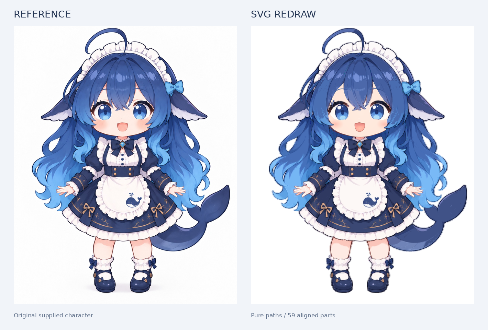
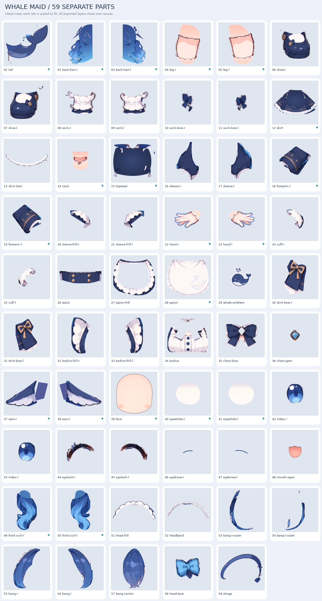

# 鲸鱼女仆：SVG 重绘与拆分素材

蓝色大肥鲸女仆角色的矢量重绘与 Live2D 向分层素材包。

## 效果一览

| 提示词配套参考图（输入） | SVG 重绘结果（输出） |
|:---:|:---:|
|  |  |
| `prompt-reference.png` | `whale-maid.svg` / `whale-maid.png` |

矢量对照与部件总览：

| 参考 vs 矢量 | 部件接触表 |
|:---:|:---:|
|  |  |

> 完整矢量文件：[`whale-maid.svg`](whale-maid.svg)（59 个命名部件组，Inkscape 图层；约 41MB，浏览器直接打开可能较慢，建议下载后用 Inkscape / Illustrator 查看）。
> 独立部件 SVG 见 [`parts/svg/`](parts/svg/)。

## 生成与目标

- **生成模型**：GPT-6-Astra
- **生成提示词**：`我给你这张图片，请你重新绘制一张svg+拆分。`
- **提示词配套参考图**：[`prompt-reference.png`](prompt-reference.png)（上表左侧，本次重绘所依据的角色图）
- **高分辨率参考**：[`reference.png`](reference.png)（1229×1536，管线中用于描摹与校验）
- **后续目标**：将分层 PSD / SVG 通过 **[psd2live](https://github.com/tsunehimatoi/psd2live)** 制作成 Live2D 的 `.cmo3` / `.moc3` 系列文件
- **当前状态**：已完成 SVG 重绘 + 59 层语义拆分与 PSD 交付；`.moc3` 尚未生成（见下文 [psd2live 工作流](#关于-psd2live)）

本稿依据用户提供的角色参考图制作。身体、头发与服装采用轮廓、色块转路径及部件边界划分；脸底、眼白、眉毛和嘴部另用原生曲线与渐变重画，使脸底不携带原先被遮挡位置的眉眼和发边。尽量保留原图比例、表情、色彩与装饰，但部分光影和线条会有所简化。SVG 中不嵌入位图。为保留原图细节，路径数量较多，并非极简线稿。

## 关于 psd2live

**psd2live**（[tsunehimatoi/psd2live](https://github.com/tsunehimatoi/psd2live)）是一个开源的 Live2D 自动建模流水线与桌面应用：输入**分层 PSD**，自动完成图层语义识别、连通域双侧拆分、自适应三角网格、九轴面部变形器、头发物理与待机动作，一键导出可在 Cubism Modeler 中继续编辑的 `.cmo3`，以及运行时 `.moc3` 文件族（含 `model3.json` / `physics3.json` / `idle.motion3.json` / 贴图集）。

| 项目 | 说明 |
|---|---|
| 仓库 | https://github.com/tsunehimatoi/psd2live |
| 许可 | GPL-3.0（独立开源项目，与 Live2D Inc. 无隶属关系） |
| 运行环境 | JDK 21+；Windows / Linux / macOS |
| 输入 | 分层 PSD（建议按其语义命名规范：`face` / `eyewhite` / `irides` / `eyelash` / `mouth` / `front hair` / `back hair` / `tail` 等） |
| 输出 | `.cmo3` + `.moc3` + `.model3.json` + `.physics3.json` + `.idle.motion3.json` + 纹理集 |
| GUI | Windows 下运行 `run-gui.bat`；`Ctrl+O` 打开 PSD → `Ctrl+R` 分析 → `Ctrl+G` 生成导出 |
| CLI 示例 | `gradlew -p ./psd2live run --args="--input sample.psd --output ./out --atlas 4096 --mesh-spacing 48"` |

### 本仓库与 psd2live 的衔接

本仓库交付的是**分层美术素材**，不是绑定完成的 Live2D 模型：

```text
prompt-reference.png / reference.png
        │  GPT-6-Astra 提示词：重绘 SVG + 拆分
        ▼
whale-maid.svg  +  parts/svg/*  +  parts/png/*
        │  栅格化 / 图层命名对齐
        ▼
whale-maid-layered.psd   （59 层，层序与画布偏移已保留）
        │  psd2live（目标管线）
        ▼
.cmo3 / .moc3 / physics3 / idle.motion3   （尚未在本仓库生成）
```

层名已尽量贴近 psd2live 常用语义（`face`、`eyewhite`、`irides`、`eyelash`、`eyebrow`、`mouth-open`、`bang-*`、`back-hair-*`、`tail` 等），导入前仍建议对照其 [PSD 图层规范](https://github.com/tsunehimatoi/psd2live/blob/main/docs/zh/PSD_LAYER_SPEC.md) 做一次改名与层序预检。

相关本机流水线实验记录见：[daoming07280/live2d-auto-pipeline](https://github.com/daoming07280/live2d-auto-pipeline)。

## 文件

| 文件 | 用途 |
|---|---|
| `whale-maid.svg` | **完整角色 SVG**，59 个命名部件组，支持 Inkscape 图层 |
| `whale-maid.png` | 透明底合成图（SVG 渲染预览） |
| `whale-maid-layered.psd` | 59 层栅格绘图素材，保留层序和位置（psd2live 直接输入） |
| `parts/svg/` | 59 个独立部件 SVG |
| `parts/png/` | 59 个独立透明部件 PNG |
| `prompt-reference.png` | **提示词配套参考图**（GPT-6-Astra 输入侧） |
| `reference.png` | 高分辨率重绘参考（1229×1536） |
| `comparison.png` | 参考图与矢量结果并排对照 |
| `parts-contact-sheet.png` | 部件放大总览；展示时缩放，实际文件保持对齐 |
| `manifest.json` | 每层中文说明、文件名、顺序、边界及补绘面积 |
| `validation.json` | 画布、层数、路径数与校验误差 |
| `build/` | 从参考图到分层 SVG/PSD 的复现脚本 |

## 坐标与拆分

- 整图、独立 SVG 和 PNG 均为 **1229 × 1536**，左上角为原点。导入时保持原位置，不按内容居中。
- 文件名前缀从底层到顶层递增。PSD 层边界按内容裁切，但保留原画布坐标偏移。
- `r` 为角色右侧，即画面左侧；`l` 反之。
- 头部包括：脸底、左右眼白、左右虹膜、左右上睫毛、眉毛、张口、刘海、侧卷发、后发、呆毛、鳍耳、头饰与发侧蝴蝶结。
- 身体包括：脖颈、上衣底、胸前衬衣与花边、领结和宝石、蓬袖、小臂袖、袖边、手、手腕花边、腰封、裙身与裙摆花边、围裙、鲸鱼图案、裙饰、腿、袜口、袜饰、鞋及鲸尾。

## 遮挡补绘

脸底、眼白、后发、侧发根、身体衣料、围裙底、脖颈、手腕、腿和尾根有推测的补绘余量。`*-visible` 为可见部分的描摹，`*-reconstructed` 为遮挡区域补绘，`*-redrawn` 为重新绘制的完整五官或脸底，可分别编辑。

补绘范围限制在中立姿势被其他部件遮挡的区域，避免改变合成外观。隐藏区域没有真实参考，因此主要用于后续小幅调整和建模起稿；大角度转头、转身以及大幅摆动需要继续补绘和检查接缝。

## Live2D 接续工作

这份交付是**分层美术素材**，尚不是绑定完成的 Live2D 模型。未生成 `.cmo3` 或 `.moc3`；没有完整闭眼、口型、转头参数或物理绑定，也未在 Cubism Editor 内实测导入。

建议流程：

1. 用 `whale-maid-layered.psd` 导入 psd2live（或 Cubism Editor）
2. 按 psd2live 规范核对层名与层序（尤其 `eyewhite` 在 `irides` 之下、睫毛仅上睫毛、嘴为最大张口）
3. 自动或手动完成：眼部开合与视线 → 头部小幅转向 → 呼吸 → 头发、鳍耳与鲸尾物理
4. 开始时用小角度验证补绘边缘，再扩大动作范围

## 复现

Python 依赖：Pillow、NumPy、SciPy、vtracer、psd-tools；Node 依赖：sharp。脚本保留在 `build/` 中。将脚本放到素材根目录后依次运行 `prepare.py`、`masks.cjs`、`partition.py`、`build-vectors.py`、`apply-native-face.py`、`render.cjs`、`package-assets.py`。临时 `work/` 与 `masks/` 不列入交付包。
